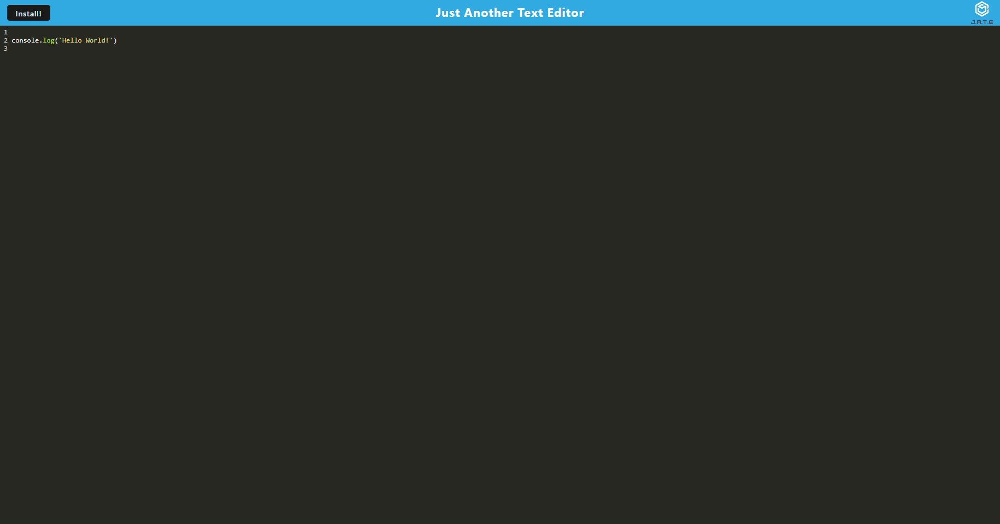

# JATE
  
  ## Table of Contents
  [Description](#description)
  [Installation](#installation)
  [Usage](#usage)
  [Questions](questions)
  [License](license)

  ## Description
  Progressive Web App text editor than can be used both online in the browser and offline by installing.
  https://elijah-jate-5c9a4472256e.herokuapp.com/
    
  
  ## Installation
  Clone github repository
  type 'npm install' into console

  ## Usage
  type npm run start into console
  go to localhost:3000 to use in browser, click install to install.

  ## Questions
  https://github.com/ElijahAFrancis
  efrancis64@gmail.com

  ## License
    Licensed under the MIT license
    https://www.mit.edu/~amini/LICENSE.md
  